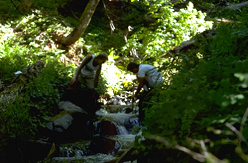
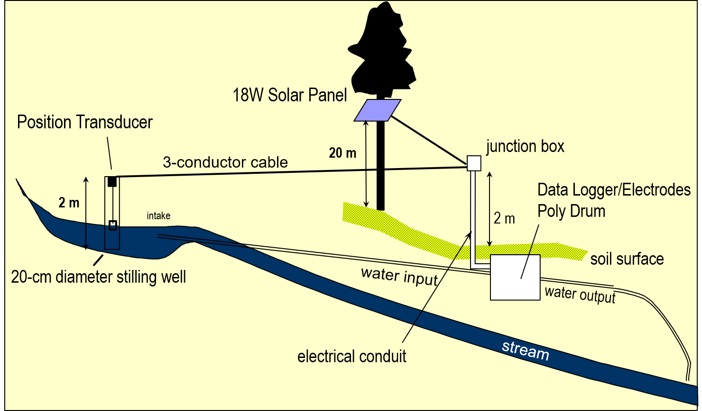
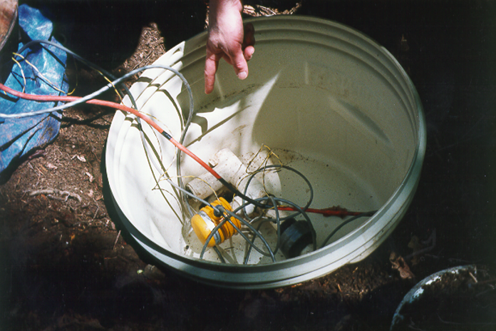
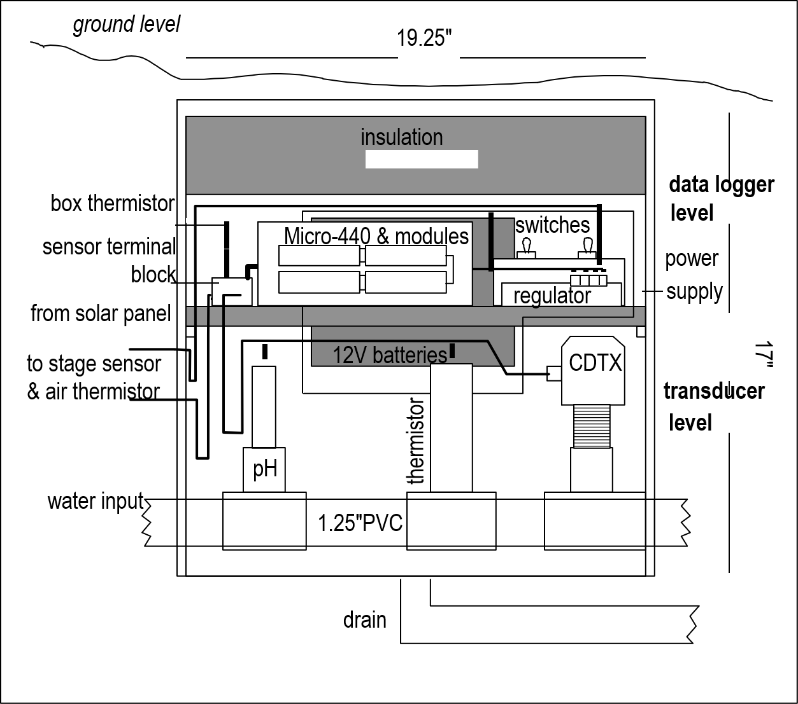
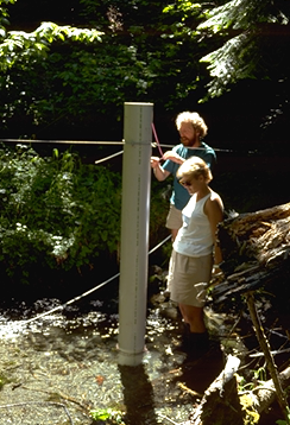

# Time Series

```{r}
plot(stl(co2, s.window = "periodic")) # co2 is already a time series
```

A time series (ts) is created with the ts() function.

- the time unit can be anything – not actually saved with the ts
- observations must be a regularly spaced series

```{r message=F, warning=F}
library(tidyverse)
SFhighF <- c(58,61,62,63,64,67,67,68,71,70,64,58)
SFlowF  <- c(47,48,49,50,51,53,54,55,56,55,51,47)
SFhighC <- (SFhighF-32)*5/9
SFlowC  <- (SFlowF-32)*5/9
SFtempC <- bind_cols(high=SFhighC,low=SFlowC)
plot(SFtempC);                  plot(ts(SFtempC))

```

### frequency setting

Frequency setting is a key parameter for ts()

- sets how many observations per time unit
- ts() mostly doesn't seem to care what the time unit is, however some functions figure it out, at least for an annual time unit, e.g. that 1-12 means months when there's a frequency of 12

```{r message=F, warning=F}
plot(ts(SFtempC, frequency=1), main="monthly time unit")
plot(ts(SFtempC, frequency=12), main="yearly time unit")

```

**frequency < 1**

If you have data of lower frequency than 1 per unit

- e.g. greenhouse gas data values every 20 years, starting in year 20, frequency 1/20 = 0.05

```{r warning=F, message=F}
library(dslabs)
data("greenhouse_gases")
GHGwide <- pivot_wider(greenhouse_gases, names_from = gas, 
                       values_from = concentration)
GHG <- ts(GHGwide, frequency=0.05, start=20) 
plot(GHG)

```

**start and end parameters**

- the time of the first (start) and last (end) observations. Either a single number or a vector of two numbers (the second of which is an integer), which specify a natural time unit and a (1-based) number of samples into the time unit.
- Example with year as the time unit and monthly data, starting July 2019 and ending June 2020:

`frequency=12, start=c(2019,7), end=c(2020,6)`

### moving average (ma)

- Simple generalization of sequential data
- The order parameter is how many values are averaged in the moving window
   - should be an odd number
   
```{r message=F, warning=F}
library(forecast)
ts(SFtempC, frequency=12)
ma(ts(SFtempC,frequency=12),order=3)
```

**moving average of CO2 data**

Difference shows time-local fluctuations, a component of the data

```{r message=F, warning=F}
library(dslabs)
data("greenhouse_gases")
GHGwide <- pivot_wider(greenhouse_gases, 
           names_from = gas, 
           values_from = concentration)
CO2 <- ts(GHGwide$CO2,
          frequency = 0.05)
library(forecast)
CO2ma <- ma(CO2, order=7)
plot(CO2)
plot(CO2ma)
plot(CO2-CO2ma)
```

### loess (local regression) smoothing

[place holder -- need to work out]

From: 

<a href="https://www.rdocumentation.org/packages/stats/versions/3.6.2/topics/loess">https://www.rdocumentation.org/packages/stats/versions/3.6.2/topics/loess</a> 

Local Polynomial Regression Fitting

- Fit a polynomial surface determined by one or more numerical predictors, using local fitting.

From:  
<a href="http://r-statistics.co/Loess-Regression-With-R.html">http://r-statistics.co/Loess-Regression-With-R.html</a>

a non-parametric approach that fits regressions within local neighborhoods

- if X variables are bound within a range  [?]

## Decomposing time series

: separating a time series into its constituent components. 

- original data
- trend component, removes seasonal and remainder
- if seasonal, also a seasonal component. Note that **season** relates to the time unit. If 1 year, "seasonality" refers to the
normal usage of seasons over a year. But if 1 day, seasons refers to different parts of a day, etc.
- irregular "random" remainder (time-local variation)

There are two common decomposition methods, the classic method `decompose` using moving averages, which we'll look
at first, then the "loess" method used by `stl`.

**Mauna Loa CO~2~ data with seasonality**

A good place to see the effect of seasonality is to look at the Mauna Loa CO~2~ data, which shows regular annual cycles, yet with
a regularly increasing trend over the years. The decomposition shows the original observations, followed by a trend line that removes the seasonal and local (short-term) random irregularities, a detrended *seasonal* picture which removes that trend to just show the seasonal cycles, followed by the random irregularities. Note the vertical scale: the units are all the same -- parts per million -- so the actual amplitude of the seasonal cycle should be the same as the annual amplitude of the observations, it's just scaled to the chart height, which tends to exaggerate the seasonal cycles and random irregularities. 

```{r message=F, warning=F, fig.cap="Decomposition of Mauna Loa monthly co2 time series (in base) extending from 1959 to 1981"}
plot(decompose(co2))
```

**Seasonal decomposition using loess**

The `stl` function stands for "Seasonal decomposition of Time series by Loess".  
Loess is a smoothing algorithm, that wor. If s.window = "periodic" the mean is used for smoothing;
the seasonal values are removed and the remainder smoothed to find the trend. 


```{r message=F, warning=F}
plot(stl(co2, s.window="periodic"))

```

**Marble Mountains karst resurgence study**

For a study of chemical water quality and hydrology of a karst system in the Marble Mountains of California, 
a spring *resurgence* was instrumented to measure water level, temperature, and specific conductance (a surrogate for total dissolved solids) over a 4-year period.








```{r message=F, warning=F}
library(tidyverse); library(lubridate)
resurg <- read_csv(system.file("extdata","resurgenceData.csv",package="iGIScData")) %>%
  mutate(date_time = mdy_hms(paste(date, time))) %>%
  dplyr::select(date_time, ATemp, BTemp, wlevelm, EC, InputV)
resurgTS <- ts(resurg, frequency = 12*365, start = c(1994, 266*12+7))
plot(resurgTS)
wlevelm <- ts(resurg$wlevelm, frequency = 12*365, 
              start = c(1994, 266*12+7))
fit <- stl(wlevelm, s.window="periodic")
plot(fit)
```

### lag regression

```{r warning=F, message=F}
library(readxl)
BugacSolstice <- read_xls(system.file("extdata", "SolarRad_Temp.xls", package="iGIScData"), 
                          sheet="BugacHungary", col_types = "numeric") %>%
  filter(Year != "YYYY" & `Day of Yr` < 177 & `Day of Yr` > 168) %>%
  dplyr::select(SolarRad, Tair)
BugacSolsticeTS <- ts(BugacSolstice, frequency = 48)
plot(BugacSolstice, main="a simple scatter plot that illustrates hysteresis"); plot(BugacSolsticeTS)
mod <- function(i) {sqrt(sum(lm(Tair~lag(SolarRad,i), data=BugacSolsticeTS)$resid**2))}
for(i in 0:5){print(paste(i,":",mod(i),sep=""))}
SolarRad_comp <- decompose(ts(BugacSolstice$SolarRad, frequency = 48))
Tair_comp <- decompose(ts(BugacSolstice$Tair, frequency = 48))
seasonals <- bind_cols(Rad = SolarRad_comp$seasonal, Temp = Tair_comp$seasonal)
ggplot(seasonals) + 
  geom_line(aes(x=seq_along(Rad), y=Rad/50), col="red", size=1) + 
  geom_line(aes(x=seq_along(Temp), y=Temp), col="darkgreen",size=1) +
  scale_x_continuous(breaks = seq(0,480,12))
which.max(seasonals$Rad)
which.max(seasonals$Temp)
```

```{r warning=F, message=F}
library(readxl)
ManausSolstice <- read_xls(system.file("extdata", "SolarRad_Temp.xls", package="iGIScData"), 
                          sheet="ManausBrazil", col_types = "numeric") %>%
  filter(Year != "YYYY" & `Day of Yr` < 177 & `Day of Yr` > 168) %>%
  dplyr::select(SolarRad, Tair)
ManausSolsticeTS <- ts(ManausSolstice, frequency = 48)
plot(ManausSolstice, main="Manaus Brazil"); plot(ManausSolsticeTS)
mod <- function(i) {sqrt(sum(lm(Tair~lag(SolarRad,i), data=ManausSolsticeTS)$resid**2))}
for(i in 0:5){print(paste(i,":",mod(i),sep=""))}
SolarRad_comp <- decompose(ts(ManausSolstice$SolarRad, frequency = 48))
Tair_comp <- decompose(ts(ManausSolstice$Tair, frequency = 48))
seasonals <- bind_cols(Rad = SolarRad_comp$seasonal, Temp = Tair_comp$seasonal)
ggplot(seasonals) + 
  geom_line(aes(x=seq_along(Rad), y=Rad/50), col="red", size=1) + 
  geom_line(aes(x=seq_along(Temp), y=Temp), col="darkgreen",size=1) +
  scale_x_continuous(breaks = seq(0,480,12))
which.max(seasonals$Rad)
which.max(seasonals$Temp)
```
