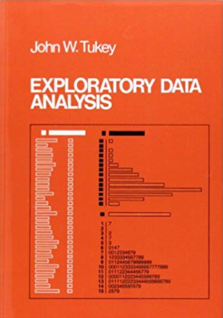

--- 
title: "Introduction to Environmental Data Science"
author:
- name: Jerry Davis, SFSU Institute for Geographic Information Science
contributor:
- name: Anna Studwell, SFSU Institute for Geographic Information Science (cover illustration)
date: "`r Sys.Date()`"
site: bookdown::bookdown_site
output: 
  bookdown::gitbook:
     cover-image: "img/eaRth_anna.png"
  bookdown::epub_book:
     cover-image: "img/eaRth_anna.png"
documentclass: book
bibliography: [book.bib, packages.bib]
biblio-style: apalike
link-citations: yes
thanks: Cover illustration by Anna Studwell
github-repo: iGISc/EnvDataSci
description: "Background, concepts and exercises for using R for environmental data science.  The focus is on applying the R language and various libraries for data abstraction, transformation, data analysis, spatial data/mapping, statistical modeling, and time series, applied to environmental research. Applies exploratory data analysis methods and tidyverse approaches in R, and includes contributed chapters presenting research applications, with associated data and code packages."
---

```{r setup, include=FALSE}
knitr::opts_chunk$set(echo = TRUE, warning = FALSE, message = FALSE)
```

# Introduction {#chapter00.chapter_section .intro_section}

 

Data science is *an inter-disciplinary field that uses scientific methods, processes, algorithms and systems to extract knowledge and insights from many structural and unstructured data* (Wikipedia). A data science approach is especially suitable for applications involving large and complex data sets that challenge conventional methods, and environmental data is a prime example, with rapidly growing collections from automated sensors in space and time domains. 

*Environmental* data science is data science applied to environmental science research. In general data science can be seen as being the intersection of math & statistics, computer science/IT, and some research domain, and in this case it's environmental:


## Tools for Environmental Data Science

Tools needed for environmental research can include many things since environmental *data* can include many things, including environmental measurements in time and space domains.

- Data analysis and transformation methods
   - importing and other methods to create rectangular data frames 
   - reorganization and creation of fields
   - filtering observations
   - data joins
   - stratified statistical summaries
   - reorganizing data, including pivots
- Modeling
   - physical models 
   - statistical modeling
   - models based on machine learning algorithms
- Visualization
   - graphics
- Spatial analysis & maps
   - vector and raster spatial analysis, e.g.
      - spatial joins
      - distance analysis
      - overlay analysis 
   - spatial statistics
   - static and interactive maps
- Time series
   - analyzing and visualizing long-term data records (e.g. for climate change)
   - analyzing and visualizing high-frequency data from loggers
   
## Big Data, Data Mining, and Exploratory Data Analysis 

**Big data**: *data having a size or complexity too big to be processed effectively by traditional software*

- data with many cases or dimensions (including imagery)
- used in business informatics
- many applications in environmental science due to the great expansion of automated environmental data capture in space and time domains
- big data challenges exist across the spectrum of the environmental research process, from data capture, storage, sharing, visualization, querying...

**Data Mining**: *discovering patterns in large data sets*

- databases collected by government agencies
- imagery data from satellite, aerial (including drone) sensors
- time-series data from long-term data records or high-frequency data loggers
- methods may involve machine learning / artificial intelligence / computer vision

**Exploratory data analysis**: *procedures for analyzing data, techniques for interpreting the results of such procedures, ways of structuring data to make its analysis easier*

- summarizing
- restructuring
- visualization
       
### Exploratory Data Analysis
   
Just as *exploration* is a part of what *National Geographic* has long covered, it's an important part of geographic and environmental science research.  


**Exploratory Data Analysis** is exploration applied to data, and has grown as an alternative approach to traditional statistical analysis. This basic approach perhaps dates back to the work of Thomas Bayes in the 18th century, but @tukey1961 may have best articulated the basic goals of this approach in defining the "data analysis" methods he was promoting: "Procedures for analyzing data, techniques for interpreting the results of such procedures, ways of planning the gathering of data to make its analysis easier, more precise or more accurate, and all the machinery and results of (mathematical) statistics which apply to analyzing data."  

Some years later @tukey1977 followed up with *Exploratory Data Analysis* 


- EDA is an approach to analyzing data via summaries and graphics.  The key word is *exploratory*.
   - In contrast to *confirmatory* statistics
- Objectives:
   - suggest hypotheses
   - assess assumptions on which inference will be based
   - select appropriate statistical tools
   - guide further data collection
- Led to the development of S, then R
   - Built on clear design and extensive, clear graphics, one key to exploring data
   - S Developed at Bell Labs by John Chambers, 1976

   - R is a language and environment for statistical computing and graphics. It is a GNU project which is similar to the S language and environment which was developed at Bell Laboratories (formerly AT&T, now Lucent Technologies) by John Chambers and colleagues.


## Software and data we'll need

First, we're going to use the R language.  It's not the only way to do data analysis, 
and probably Python is the leading data science overall, but R is clearly the leading such 
language for academic research, especially in the environmental sciences.

For a start, you'll need to have R and RStudio installed, and at least the following packages:

- tidyverse (to include ggplot2, dplyr, tidyr, stringr, etc.)
    - ggplot2
    - dplyr
    - stringr
    - tidyr
- lubridate
- sf
- raster
- tmap

There will be others we'll meet along the way.

To install these packages, the following code will work:

```
install.packages(c("tidyverse", "lubridate", "sf", "raster", "tmap"))
```

You can always add more packages as needed, do them one at a time, whatever. But 
generally *don't reinstall the packages again with the unless you actually want to reinstall it*, maybe because it's been updated. So generally I don't include `install.packages()` in my script. Once installed, you can access the packages with the library function, e.g.

```{r message=F}
library(tidyverse)
```

which you *will* want to include in your script.
 
### Data

We'll be using data from various sources, including data on CRAN like the code packages 
above which you install the same way -- so use `install.packages("palmerpenguins")`. 

We've also created a repository on GitHub that includes data we've developed in the iGISc at SFSU, and you'll need to install that package a slightly different way. 


GitHub packages require a bit more work on the user's part since we need to first install `remotes`^[Note: you can also use `devtools` instead of `remotes` if you have that installed. They do the same thing; `remotes` is a subset of `devtools`. If you see a message about Rtools, you can ignore it since that is only needed for building tools from C++ and things like that.], then use that to install the GitHub data package:

```
install.packages("remotes")
remotes::install_github("iGISc/iGIScData")
```


Then you can access it just like other built-in data by including:

```{r message=F}
library(iGIScData)
```

To see what's in it, you'll see the various datasets listed in:

```
data(package="iGIScData")
```

For instance, the following is a map of California counties using the CA_counties sf (simple features) data:

```{r}
library(tidyverse); library(iGIScData); library(sf)
ggplot(data=CA_counties) + geom_sf()
```


Those package datasets can be used directly as sf data (if the sf library is installed) or data frames (all tibbles).  Raw data can also be read from the `extdata` folder that is installed on your computer when you install the package, using code such as:

```
csvPath <- system.file("extdata","TRI_1987_BaySites.csv", package="iGIScData")
TRI87 <- read_csv(csvPath)
```

or something similar for shapefiles, such as:

```
shpPath <- system.file("extdata","trails.shp", package="iGIScData")
trails <- st_read(shpPath)
```

