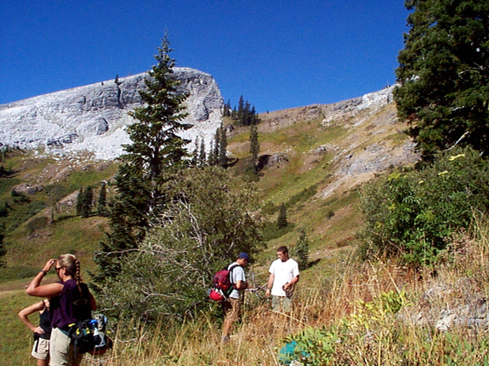

```{r include=FALSE}
knitr::opts_chunk$set(echo = TRUE, warning = FALSE, message = FALSE)
```

# Visualization

In this section we'll explore visualization methods in R. Visualization has been a key element of R since its inception, since visualization is central to the exploratory philosophy of the language. The base *plot* system generally does a good job in coming up with the most likely graphical output based on the data you provide. 

```{r include=FALSE}
library(tidyverse)
library(palmerpenguins)
```

```{r fig.cap="Flipper length by species"}
plot(penguins$body_mass_g, penguins$flipper_length_mm)
plot(penguins$species, penguins$flipper_length_mm)
```

Antarctic peninsula penguin data is from @palmer.

## ggplot2

We'll mostly focus however on gpplot2, based on the *Grammar of Graphics* because it provides considerable control over your graphics while remaining fairly easily readable, as long as you buy into its grammar.

ggplot2 looks at three aspects of a graph:

- data : where are the data coming from?
- geometry : what type of graph are we creating?
- aesthetics : what choices can we make about symbology and how do we connect symbology to data?

See https://rstudio.com/wp-content/uploads/2015/03/ggplot2-cheatsheet.pdf

The ggplot2 system provides plots of single and multiple variables, using various coordinate systems (including geographic).


## Plotting one variable

- continuous
    - histograms
    - density plots
    - dot plots
- discrete
    - bar

[**Create a new `NDVI` project**]

We'll look at a study of Normalized Difference Vegetation Index from a transect across a montane meadow in the northern Sierra Nevada, derived from multispectral drone imagery [@NDVI].

```{r message=F}
library(iGIScData)
library(tidyverse)
summary(XSptsNDVI)
ggplot(XSptsNDVI, aes(vegetation)) + 
  geom_bar()
```

### Histogram

**First, to prepare the data, we need to use a pivot_longer on XSptsNDVI:**

```{r warning=F, message=F}
XSptsPheno <- XSptsNDVI %>%
  filter(vegetation != "pine") %>%
  pivot_longer(cols = starts_with("NDVI"), names_to = "phenology", values_to = "NDVI") %>%
  mutate(phenology = str_sub(phenology, 5, str_length(phenology)))
```

```{r warning=FALSE, message=F, fig.cap="Distribution of NDVI, Knuthson Meadow"} 
XSptsPheno <- read_csv("data/XSptsPheno.csv")
XSptsPheno %>%
  ggplot(aes(NDVI)) + 
  geom_histogram(binwidth=0.05)
```

**Normal histogram**: easier to visualize the distribution, see modes [**`sierra`**]
```{r warning=FALSE, message=F, fig.cap="Distribution of Average Monthly Temperatures, Sierra Nevada"}
sierraData %>%
    ggplot(aes(TEMPERATURE)) +
  geom_histogram(fill="dark green")
```

**Cumulative histogram with proportions**: easier to see percentiles, median
```{r warning=FALSE, fig.cap="Cumulative Distribution of Average Monthly Temperatures, Sierra Nevada"}
n <- length(sierraData$TEMPERATURE)
sierraData %>%
  ggplot(aes(TEMPERATURE)) +
  geom_histogram(aes(y=cumsum(..count..)/n), fill="dark goldenrod")

```

### Density Plot

Density represents how much out of the total. The total area (sum of widths of bins times densities of that bin) adds up to 1. [**`NDVI`**]

```{r warning=F, fig.cap="Density plot of NDVI, Knuthson Meadow"}
XSptsPheno %>% 
  ggplot(aes(NDVI)) + 
  geom_density()
```

Note that NDVI values are <1 so bins are very small numbers, so in this case densities can be >1.

**Using alpha and mapping phenology as fill color**.  This illustrates two useful ggplot methods:

- "mapping" a variable (phenology) to an aesthetic property (fill color of the density polygon)
- setting a a property (alpha = 0.2) to all polygons of the density plot.  The alpha channel of colors defines its opacity, from invisible (0) to opaque (1) so is commonly used to set as its reverse, transparency.

```{r}
XSptsPheno %>%
  ggplot(aes(NDVI, fill=phenology)) +
  geom_density(alpha=0.2)
```

```{r include=FALSE}
## DON'T REALLY NEED THIS -- STORED AS tidy_eucoak
library(tidyverse)
runoffPivot <- eucoakrainfallrunoffTDR %>%
  pivot_longer(cols = starts_with("runoffL_"), 
               names_to = "tree", values_to = "runoff_L") %>%
  mutate(
    tree = str_sub(tree, str_length(tree)-2, str_length(tree)),
    Date = as.Date(date, "%m/%d/%Y"))  # variable date is just a string, needs converting to date format
euc <- runoffPivot %>%
  filter(tree == "euc") %>%
  mutate(
    rain_subcanopy = rain_euc,
    slope = slope_euc,
    aspect = aspect_euc,
    surface_tension = surface_tension_euc,
    runoff_rainfall_ratio = runoff_rainfall_ratio_euc) %>%
  dplyr::select(site, `site #`, tree, Date, month, rain_mm, rain_subcanopy, slope, aspect, runoff_L,
         surface_tension, runoff_rainfall_ratio)
oak <- runoffPivot %>%
  filter(tree == "oak") %>%
  mutate(
    rain_subcanopy = rain_oak,
    slope = slope_oak,
    aspect = aspect_oak,
    surface_tension = surface_tension_oak,
    runoff_rainfall_ratio = runoff_rainfall_ratio_oak) %>%
  dplyr::select(site, `site #`, tree, Date, month, rain_mm, rain_subcanopy, slope, aspect, runoff_L,
         surface_tension, runoff_rainfall_ratio)
eucoak <- rbind(euc, oak)
write_csv(eucoak, "data/tidy_eucoak.csv")
```

[**`eucoak`**]

```{r warning=FALSE, fig.cap="Runoff under Eucalyptus and Oak in Bay Area sites"}
tidy_eucoak %>%
  ggplot(aes(log(runoff_L),fill=tree)) +
  geom_density(alpha=0.2)
```

### boxplot

```{r warning=FALSE, fig.cap="Runoff under Eucalyptus and Oak, Bay Area Sites"}
ggplot(data = tidy_eucoak) +
  geom_boxplot(aes(x = site, y = runoff_L))

```
**Get color from tree within `aes()`**
```{r warning=FALSE, fig.cap="Runoff at Bay Area Sites, colored as Eucalyptus and Oak"}
ggplot(data = tidy_eucoak) +
  geom_boxplot(aes(x=site, y=runoff_L, color=tree))

```

**Visualizing soil CO_2_ data with a Tukey box plot**

[**`soilCO2`**] In a study of soil CO_2_ in the Marble Mountains of California, we 
sampled extracted soil air in a 11-point transect across Marble Valley in 1997.  [@marblesCO2]



```{r warning=FALSE, fig.cap = "Visualizing soil CO_2_ data with a Tukey box plot"}
soilCO2 <- soilCO2_97
soilCO2$SITE <- factor(soilCO2$SITE)  # in order to make the numeric field a factor
ggplot(data = soilCO2, mapping = aes(x = SITE, y = `CO2%`)) +
  geom_boxplot()

```


## Plotting two variables
### Two continuous variables

[**`sierra`**] We've looked at this before -- the scatterplot 

```{r warning=FALSE, fig.cap="Scatter plot of February temperature vs elevation"}
ggplot(data=sierraFeb) + 
  geom_point(mapping = aes(TEMPERATURE, ELEVATION))

```

- The aes ("aesthetics") function specifies the variables to use as x and y coordinates 
- geom_point creates a scatter plot of those coordinate points

**Set color for all (*not* in aes())**

```{r warning=FALSE}
ggplot(data=sierraFeb) + 
  geom_point(aes(TEMPERATURE, ELEVATION), color="blue")
```

- color is defined outside of aes, so is applies to all points.
- mapping is first argument of  geom_point, so `mapping = ` is not needed.

### Two variables, one discrete 

[**`eucoak`**]

```{r warning=FALSE, fig.cap="Two variables, one discrete"}
ggplot(tidy_eucoak) +
  geom_bar(aes(site, runoff_L), stat="identity")
```

## Color systems

You can find a lot about color systems. See these sources:

<a href="http://sape.inf.usi.ch/quick-reference/ggplot2/colour">http://sape.inf.usi.ch/quick-reference/ggplot2/colour</a>
<a href="http://applied-r.com/rcolorbrewer-palettes/">http://applied-r.com/rcolorbrewer-palettes/</a>

### Color from variable, in aesthetics

In this graph, color is defined inside aes, so is based on COUNTY [**`sierra`**]

```{r warning=FALSE, fig.cap="Color set within aes()"}
ggplot(data=sierraFeb) + 
  geom_point(aes(TEMPERATURE, ELEVATION, color=COUNTY))

```

**Plotting lines using the same x,y in aesthetics**

```{r warning=FALSE, fig.cap="Using aesthetics settings for both points and lines"}
sierraFeb %>%
  ggplot(aes(TEMPERATURE,ELEVATION)) +
  geom_point(color="blue") +
  geom_line(color="red")
```

Note the use of pipe to start with the data then apply ggplot. [**`generic_methods`**]

**River map & profile**

```{r fig.cap="Longitudinal Profiles"}
x <- c(1000, 1100, 1300, 1500, 1600, 1800, 1900)
y <- c(500, 700, 800, 1000, 1200, 1300, 1500)
z <- c(0, 1, 2, 5, 25, 75, 150)
d <- rep(NA, length(x))
longd <- rep(NA, length(x))
s <- rep(NA, length(x))
for(i in 1:length(x)){
  if(i==1){longd[i] <- 0; d[i] <-0}
  else{
    d[i] <- sqrt((x[i]-x[i-1])^2 + (y[i]-y[i-1])^2)
    longd[i] <- longd[i-1] + d[i]
    s[i-1] <- (z[i]-z[i-1])/d[i]}}
longprofile <- bind_cols(x=x,y=y,z=z,d=d,longd=longd,s=s)
ggplot(longprofile, aes(x,y)) +
  geom_line(mapping=aes(col=s), size=1.2) + 
  geom_point(mapping=aes(col=s, size=z)) +
  coord_fixed(ratio=1) + scale_color_gradient(low="green", high="red") +
  ggtitle("Simulated river path, elevations and slopes")
ggplot(longprofile, aes(longd,z)) + geom_line(aes(col=s), size=1.5) + geom_point()  +
  scale_color_gradient(low="green", high="red") +
  ggtitle("Elevation over longitudinal distance upstream")
```
```{r message=F, warning=F, fig.cap="Slope by longitudinal distance"}
ggplot(longprofile, aes(longd,s)) + geom_point(aes(col=s), size=3) +
  scale_color_gradient(low="green", high="red") +
  ggtitle("Slope over longitudinal distance upstream")
```

### Trend line

[**`sierra`**]

```{r warning=F, message=F, fig.cap="Trend line using geom_smooth with a linear model"}
sierraFeb %>%
  ggplot(aes(TEMPERATURE,ELEVATION)) +
  geom_point(color="blue") +
  geom_smooth(color="red", method="lm")

```

### General symbology
A useful vignette accessed by `vignette("ggplot2-specs")` lets you see aesthetic specifications for symbols, including:

- Color & fill
- Lines
   - line type, size, ends
- Polygon
   - border color, linetype, size
   - fill
- Points
   - shape
   - size
   - color & fill
   - stroke
- Text
   - font face & size
   - justification

#### Categorical symbology

One example of a "Big Data" resource is EPA's Toxic Release Inventory [**`air_quality`**] that tracks releases from a wide array of sources, from oil refineries on down.  One way of dealing with big data in terms of exploring meaning is to use symbology to try to make sense of it.

```{r message=F, warning=F, fig.cap="EPA Toxic Release Inventory, as a big data set needing symbology clarification"}
csvPath <- system.file("extdata","TRI_2017_CA.csv", package="iGIScData")
TRI <- read_csv(csvPath) %>%
  filter(`5.1_FUGITIVE_AIR` > 100 & `5.2_STACK_AIR` > 100)
ggplot(data = TRI, aes(log(`5.2_STACK_AIR`), log(`5.1_FUGITIVE_AIR`), 
                       color = INDUSTRY_SECTOR)) +
       geom_point()
```

#### Graphs from grouped data 

[**`NDVI`**]

```{r warning=FALSE, fig.cap="NDVI symbolized by vegetation in two seasons"}
XSptsPheno %>%
  ggplot() +
  geom_point(aes(elevation, NDVI, shape=vegetation, 
                 color = phenology), size = 3) +
  geom_smooth(aes(elevation, NDVI, 
                 color = phenology), method="lm") 
```

[**`eucoak`**] [@eucoak]

```{r warning=FALSE, fig.cap="Eucalyptus and Oak: rainfall and runoff"}
ggplot(data = tidy_eucoak) +
  geom_point(mapping = aes(x = rain_mm, y = runoff_L, color = tree)) +
  geom_smooth(mapping = aes(x = rain_mm, y= runoff_L, color = tree), 
              method = "lm") +
  scale_color_manual(values = c("seagreen4", "orange3"))

```

#### Faceted graphs

This is another option to displaying groups of data, with parallel graphs

```{r warning=FALSE, fig.cap="Faceted graph alternative"}
ggplot(data = tidy_eucoak) +
  geom_point(aes(x=rain_mm,y=runoff_L)) +
  geom_smooth(aes(x=rain_mm,y=runoff_L), method="lm") +
  facet_grid(tree ~ .)

```

## Titles and subtitles

```{r warning=FALSE, fig.cap="Titles added"}
ggplot(data = tidy_eucoak) +
  geom_point(aes(x=rain_mm,y=runoff_L, color=tree)) +
  geom_smooth(aes(x=rain_mm,y=runoff_L, color=tree), method="lm") +
  scale_color_manual(values=c("seagreen4","orange3")) +
  labs(title="rainfall ~ runoff", 
       subtitle="eucalyptus & oak sites, 2016")

```

## Pairs Plot

[**`sierra`**] Pairs plots are an excellent exploratory tool to see which variables are correlated. 
Since only continuous data are useful for this, and since pairs plots can quickly get
overly complex, it's good to use dplyr::select to select the continuous variables, or 
maybe use a helper function like is.numeric with dplyr::select_if:

```{r warning=FALSE, fig.cap="Pairs plot for Sierra Nevada stations variables"}
sierraFeb %>%
     dplyr::select_if(is.numeric) %>%
#    dplyr::select(LATITUDE, ELEVATION, TEMPERATURE, PRECIPITATION) %>%
  pairs()
```

## Exercises

1. Create a bar graph of the counts of the species in the **`penguins`** data frame [@palmer].  What can you say about what it shows?

```{r include=F}
library(tidyverse); library(palmerpenguins)
ggplot(penguins, aes(species)) + geom_bar()
plot(penguins$species)
```


2. Use bind_cols in dplyr to create a tibble from built-in vectors state.abb and state.region, then use ggplot with geom_bar to create a bar graph of the four regions. [**`generic_methods`**]

```{r include=F}
library(tidyverse)
regions <- bind_cols(state.abb, state.region)
ggplot(regions, aes(state.region)) + geom_bar()
```


3. Convert the built-in time series `treering` into a tibble `tr`using the `tibble()` functions with the single variable assigned as `treering = treering`, then create a histogram, using that tibble and variable for the `data` and `x` settings needed. Attach a screen capture of the histogram. 

```{r include=F}
library(tidyverse)
tr <- tibble(treering = treering)
str(tr)
ggplot(data=tr, aes(x=treering)) + geom_histogram()
```

4. Start by clearing your environment with the broom icon in the Environment tab, then we'll create two tibbles: Create a new tibble `st` using `bind_cols` with `Name=state.name`, `Abb=state.abb`, `Region=state.region`, and `as_tibble(state.x77)`. *Note that this works since all of the parts are sorted by state.* Then use `summary(st)` and copy and paste its results for your answer.

```{r include=F}
st <- as_tibble(state.x77)
library(tidyverse)
st <- bind_cols(Name=state.name, Abb=state.abb, Region=state.region, as_tibble(state.x77))
summary(st)
```

5. From `st`, create a density plot from the variable `Frost` (number of days with frost for that state).  Attach that plot, and answer: approximately what is the modal value?

```{r include=F}
#st <- as_tibble(state.x77)
ggplot(data=st, aes(x=Frost)) + geom_density()
```

6. From `st` create a a boxplot of `Area` by `Region`.  Which region has the highest and which has the lowest median Area?  Do the same for `Frost`.

```{r include=F}
ggplot(data=st, aes(x=Region, y=Area)) + geom_boxplot()
ggplot(data=st, aes(x=Region, y=Frost)) + geom_boxplot()
```

7. From st, compare murder rate (y=Murder) to Frost (x) in a scatter plot, colored by Region.

```{r include=F}
st %>%
  ggplot(aes(x=Frost, y=Murder)) + geom_point(aes(col=Region))
#print(st$Name[which.max(st$Murder)])
```

8. Add a trend line (smooth) with method="lm" to your scatterplot, not colored by Region (but keep the points colored by Region). What can you say about what this graph is showing you?

```{r include=F}
st %>%
  ggplot(aes(x=Frost, y=Murder)) + geom_point(aes(col=Region)) + geom_smooth(method="lm")
cor.test(st$Frost, st$Murder)
#print(st$Name[which.max(st$Murder)])
```

9. Add a title to your graph.


```{r include=F}
st %>%
  ggplot(aes(x=Frost, y=Murder)) + geom_point(aes(col=Region)) + geom_smooth(method="lm") +
  labs(title="Frost and Murder Rate")
```

10. Change your scatterplot to place labels using the Abb variable (still colored by Region) using `geom_label(aes(label=Abb, col=Region))`. Any observations about outliers?

```{r include=F}
st %>%
  ggplot(aes(x=Frost, y=Murder)) + geom_label(aes(label=Abb, col=Region)) + geom_smooth(method="lm")

```

